# CS314 Principles of Programming Study Guide

## Programming Languages

### Why Languages?
* Most languages are equally capable in expressing a given algorithm.
* The way they implement them tends to differ depending on the language.
	* Recursion vs loops...
* The ease of use of certain features differ by language
	* Type errors, memory leaks, state issues...


### Programming Paradigms
* Ways at looking at a problem and seeing a program
* Given the task of printing out an ascii art x on the screen using smaller xs, here are two possible ways to do it:
	* Procedurally: print one line of the x at a time from top to bottom
	* Recursively: Recursively print out the four outer corners of the xs until we reach the base case of a single x

```
Goal:
x       x  
  x   x
    x
  x   x
x       x  

Procedural:
x       x
then...
x       x
  x   x
then...
x       x  
  x   x
    x
finally... (skipping a few iterations)
x       x  
  x   x
    x
  x   x
x       x

Recursive:
x       x  
     
    
     
x       x
then...
x       x  
  x   x
    
  x   x
x       x 
finally...
x       x  
  x   x
    x
  x   x
x       x 
```

### Procedural Paradigm
* Programs are sequences of state changing actions
* You can:
	* Name memory spaces (variables)
	* Perform arithmetic
	* Assign values to memory
	* Explicit control flow statements
* Closely matches the Von Neumann architecture
* Can be too low level
	* Always specifies sequential operations
	* Hard to get high-level view of code
	* Unexprected interactions between unrelated code

### Functional Programming
* Programs are based on functions
* Characteristics of pure functional programs:
	* Variable names name values and not memory locations
	* Value binding over parameter passing (call by reference, call by value...)
	* Recursion over iteration
* Key operations are based on function application and function abstraction (lambda calculus)
* Functional languages tend to have:
	* Composition of functions
	* First class funcitons
	* Pure and total functions
* Functional programming is more declarative as in you describe what the answer should be and not how to compute it
* Requires a sophisticated compiler for good performance

### Logic Paradigm
* The most declarative paradigm
* Question and answer format
* Compiler has great freedom in the methods involved with finding the answer

### Translation
* Compilation works by translating the high level language into an executable form - usually machine code
* Interpretation works by having the program performed by a different executable program
* Some languages like Java are a mixture

## Functional Programming

### Expressions
* An expression represents a computation on values, and or sub-expressions
* We *evaluate* an expression to produce a value
* 	3 + (4 * 5) = 21

### Abstract Syntax Trees
* It is possible to describe an expression using a tree
	* Interior nodes correspond to operations
	* Leaf nodes corrrespond to literal values
* To evaluate, start at the leaves and then work up

### Variables
* Variables are abstract values
* Meaning of a variable depends on context
* Looking at the expression `x + 2` we can say that `x` is unconstrained and there for, *free*
* Evaluation will produce different values depending on what `x` is equal to

### Evaluating Variables
* A substitution maps variables names to expressions
* We can replace a variable with it's corresponding value which gives an instance of the expression
* Given we have `x + 2` if we say `x` equals `3` then the instance of the expression is `3 + 2 = 5`

### Bound Variables
* Say we are given a summation of `n^2` from `n = 1` to `100`
* Here we can see that `n^2` is parameterized by `n^2`
* The meaning of `n` is determined by the summation construct (it changes every iteration)
* We can say that `n` is a bound variable
* To evaluate this expression we must substitute in all the different values for n and add them together
	* `1^2 + 2^2 + 3^2 + ... + 100^2`

### Functions
* Functions map values in one set (domain) to values in another set called (co-domain)
	* Each element in the domain maps to a single element in the co-domain
	* Multiple elements may map to the same element in the co-domain but not the other way around 

### Function Abstraction
* We can define a function to calculate x * 2 + 3 for argument x in lambda calculus by the following format: (λx. x * 2 + 3)
	* λx indicates that x is the parameter
	* x * 2 + 3 is the function body
	* The parentheses indicate the *binding scope* of x
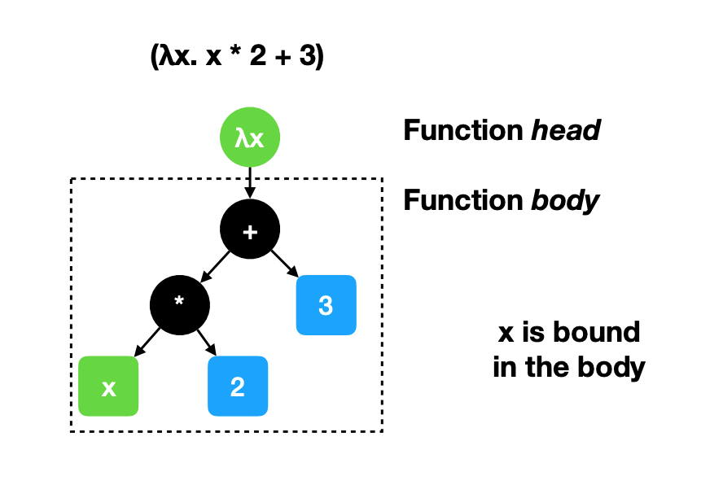

### α-Equivalence
* The name of bound variables are not considered significant so (λx. x * 2 + 3) and (λy. y * 2 + 3) are considered the same
* α-conversion lets us change the name of a bound variable
* If two expressions can be α-converted to produce the same expression, they are said to be α-equivalent

### Function Application
* Functional languages make application as minimal as possible
* In haskell we can apply function f to argument x by writing `f x`
* Function application has the highest precidense so `f 2 + 3` is equal to `(f 2) + 3`
* Function application always associates to the left so `g f x` is equal to `(g f) x`

### Evaluation by Substitution
* We can evaluate a function applied to an argument by substituting in for the variable
* This is called β-reduction
* Two expressions are considered the same if the produce the same expression after being β-reduced

### Evaluation Order
* If we evaluate the argument first then we get applicative-order evaluation (calculating the argument first)
* If we evaluate the application first then we get normal-order evaluation (substituting the argument first)
* They both produce the same result

### Applicative Order
* We prioritize calculating the arguments of a function over substituting them in.

```
(λx. x * 2 + 3)(2 + 1)
(λx. x * 2 + 3)(3)
3 * 2 + 3
6 + 3
9
```
### Normal Order
* We prioritize subtituting the arguments of a function over calculating them.

```
(λx. x * 2 + 3)(2 + 1)
(2 + 1) * 2 + 3
3 * 2 + 3
6 + 3
9
```

### Multiple Parameters
* We can apply multiple parameters to a function by returning a function after applying the first argument, to apply the second one
* Lets say we want to define a function where given x and y, return (x + y) / 2
* We get `(λx. (λy. (x + y) / 2))`, where the first function `λx. (λy. (x + y) / 2)` returns the function `λy. (x + y) / 2` after substituting for x, in which case we can then substitute for y. Lets try applying it to 3 and 5
	* (λx. (λy. (x + y) / 2)) 3 5
	* (λy. (3 + y) / 2) 5
	* (3 + 5) / 2
	* 4

### Higher-order Functions
* It is possible for functions to be an argument for other functions
* Given (λf. f 0) we take function f and apply it to 0

### Normal Forms
* We use β-reduction to transform expressions into simpler ones
* If no β-reduction is possible, then we are in β-normal form
* If the head of the expression is not an application then the expression is in head-normal form

### Head Normal Form
* The simpliest form of a particular expression
* There are no thunks inside
* Same thing as reduced normal form or just normal form
* Examples:
	* 7
	* λx. (x + 2)

### Beta Normal Form
* There are no beta reductions that can be applied
* Every function application was evaluated and there is nothing to reduce

### Non-termination
* Not every lambda expression has a normal form
* Consider (λx. x x) (λx. x x)
* It ends up reducing to itself!

## Haskell

### Basic Syntax
* Expressions: `1 + 1`, `3 * (5 - 2) / 3`
* Annonymous functions (lambda abstractions): `\x -> 3 * 5 + 1`
* Variables in haskell must begin with a lowercase letter or `_`

### Definitions
* Defining a variable: `a = 5`
* Defining a function: `fun x y z = x + y + z`

### if-then-else and Bool
* Haskell has a Bool type of values True and false
* Comparison functions like `== or > or >=` all return a Bool
* We can use `if <some boolean expression> then <statement a> else <statement b>` to choose between values
	* We must always include both branches

```haskell
fun :: Int -> Int -> Int -> Int
fun x y z = if x < 0 then y else z
```

### Pattern Guards
* Alternative to using if-then-else
* Takes the form of `| <boolean expression> = <some statement>`

```haskell
fun :: Int -> Int -> Int -> Int
fun x y z
  | x < 0 = y
  | otherwise = z
```

### Writing Functions
* Given the following function to calculate factorials: `fac n = if n > 1 then n * fac (n - 1) else 1` we can see that if n is greater than one we recurse and otherwise we just return 1 as the base case

```
fac 3
if 3 > 1 then 3 * fac (3 - 1) else 1
3 * fac (3 - 1)
3 * (if (3 - 1) > 1 then 3 * fac ((3 - 1) -1) else 1)
3 * (if 2 > 1 then 2 * fac (2 - 1) else 1)
3 * (2 * fac (2 - 1))
3 * (2 * (if (2 - 1) > 1 then (2 - 1) * fac ((2 - 1) - 1) else 1)) 
3 * (2 * (if 1 > 1 then 1 * fac (1 - 1) else 1)) 
3 * (2 * 1) 
6
```

* Notice that haskell always waits for the last possible moment to perform any calculations

### Lists
* `[]` - empty list
* `[1, 2, 3]` - list with elements
* `[1..10]` - list with a range of elements
* `[1, 3..10]` - a list with a range and a step `[1, 3, 5, 7, 9]`
* `[ x^2 | x <- [1..10] ]` - list comprehension
	* Each element in the list is x^2, where x is an element in `[1..10]`
* `[ x * y | x <- some_list, y <- some_other_list ]`
	* Generate a list where each element is the multiple of the corresponding elements in some list and some other list. 

### Creating Lists
* We can use `++` to combine two lists
	* `[1, 2, 3] ++ [4, 5] = [1, 2, 3, 4, 5]`
* Use concat to combine a list of lists into a single list
	* `concat [[1, 2], [3, 4], [5], []] = [1, 2, 3, 4, 5]`
* Use `:` to add a single element to the beginning of a list
	* `1 : [2, 3] = [1, 2, 3]`
	* `1 : 2 : 3: [] = [1, 2, 3]`  

### Using Lists
* Useful functions for lists
	* `null x` - returns True when x is empty, False otherwise
	* `length x` - returns the number of elements in x
	* `sum x` - returns the total of all the items in x
* Many are higher-order functions
	* `map f x` - returns a new list produced by applying f to every element in x
		* map (\x -> x * 2) [1, 2, 3] = [2, 4, 6]
	* `filter f x` - returns a new list containing the items in x that satisfy f
		* filter even [1, 2, 3, 4] = [2, 4]
* Suppose we wanted to write a function that gets the sum of the square of numbers from 1 to n
	* Start with a set of values `[1..n]`
	* For each value, we compute x^2 `map (\x -> x^2) [1..n]`
	* Now we find the sum of all the values `sum ((\x -> x^2) [1..n])`
	* Abstract into a function `sumSquares n = sum ((\x -> x^2) [1..n])`

### List Constructors
* `[]` nil
* `:` cons

### Pattern Matching
* We can use a pattern when defining a function
	* `swap (x, y) = (y, x)` 
	* Here, the `(x, y)` on the left is a pattern that binds two variables
* Wildcard pattern `_` matches anything but does not bind a variable

### Refutable Patterns
* Patterns like `_` and `x` are irrifutable which means they match any possible input
* Most patterns can potentially fail
	* `[]` only matches the empty list
	* `(1, x)` only matches pairs where the first element is 1

### Mutiple Cases
* Functions with refutable patterns may crash if none of them match
* The `case..of` operator can be used to select a pattern that matches a value
* If multiple cases match only the first one is used

```haskell
foo x = case x of
	[] -> "zero"
	[x] -> "one"
	[x, y] -> "two"
	_ -> "many"
	
foo [] = "zero"
foo [x] = "one"
foo [x, y] = "two"
foo [x, y, z] = "many"
foo _ = "many"

```

### Strings
* Haskell's built in String type is a list of Chars
	* `"abc"`
	* `['a', 'b', 'c']`
	* `'a' : 'b' : 'c' : []`
	* `'a' : "bc"`
* Not very efficient

### Pairs
* Bundles two values together
	* `(1, 2)` is a pair of integeres
	* `('a', True)` is a pair of a Char and a Bool 
	* `((1, 2), [3, 4])` a pair that contains another pair and a list
	* `[(1, 'a'), (2, 'b')]` a list that contains pairs of numbers and characters

### Working with pairs
* `fst` maps a pair to its first element
	* `fst (1,'a') = 1`
* `snd` maps a pair to its second element
	* `snd (1, 'a') = 'a'`
* `swap p = (snd p, fst p)`
	* `swap ('a', 2) = (2, 'a')`   

### Pattern Matching


### Evaluation Order
* In haskell we use lazy evaluation to avoid unnecessary re-computation
* Also called *call-by-need*

### Normal-order vs Lazy
* Applicative-order (eager evaluation) always evalautes the arguement before calling function
	* Arguments are evaluated exactly once
* Normal-order evaluation substitues the argument sub-expression without evaluating	* Arguments may be evaluated zero or more times
* Lazy evaluation substitutes the argument without evaluating, but avoids duplication
	* Arguments may be evaluated zero or one times

### Eager vs Lazy
* Haskell is lazy by default
* There are ways to request eager evaluation

### $ Operator
* Applies its first argument to its second argument
	* `f $ x` is equivalent to `f x` 
* Kind of similar to chaining in lodash
* Helps avoid deeply nested parentheses
	* `f (g (h x))` becomes `f $ g $ h x` 

### Operators
* Includes: `+`, `*`, etc...
* Section syntax can turn operators into functions
* Enclose operator in parentheses and omit one or both arguments
	* `(+ 1)` means `(\x -> x + 1)`
	* `(2 *)` means `(\x -> 2 * x)` 
	* `(+)` means `(\x y -> x + y)`
* Functions that take two ore more arguments can be used as operators by eclosing function name in backticks (`)
* x \`mod\` 2 is equivalent to mod x 2

### Precedence and Fixity
* Operators in Haskell have precedence, and may associate to the left or the right
* infixl and infixr determine how operators with the same precedence get parenthesized

### User-Defined Operators
* Haskell operators are defined within the language
* Any syntaxes for using an operator can be used to define one
* We can explicitly provide precedence and associativity

```haskell
a |~| b = (a + b) / 2
(|~|) a b = (a + b) / 2
infix 6 |~|
```

### Types
* Haskell is strongly typed
* We use `::` to explicitly give a type to an expression
	* `5 :: Integer`
* Built in types include:
	* Int
	* Integer
	* Char
	* Float
	* Double
	* Bool
	* Function types like IO, and others...  

### Function Types
* A function's type indentifies the types of it's arguments and it's result
* We write the type using an arrow: `domain --> co-domain`
	* `even :: Integer -> Bool`
* The arrow associate to the right
* Higher order functions require parentheses to indicate function arguments
	* `(\f -> f 0 + f 1) :: (Integer -> Integer) -> Integer`
	* Here we use parentheses to define a higher order function that takes in an integer and returns an integer that should be passed as an argument 

### Lists and Tuples
* List types are designated with brackets
	* `[Integer]` - list of integers
	* `[Char]` - list of characters
* Tuple types resemble syntax for tuple values
	* `(5, "Hello") :: (Integer, String)`

### Polymorphism
* Sometimes we don't want to restrict ourselves to a single type
* Lets say we want to make a function that can reverse any type of list
* `reverse :: [a] -> [a]`
* The `a` is a type variable which means it could be any type and will return a list of the same type

### Qualified Polymorphism
* some functions are polymorphic but can't be applied to every type
* `(+) :: (Num a) => a -> a -> a`
* Here we say that the `+` operator is defined for every type `a` that is number like

### Type Classes
* A class defines a set of values that must be defined for any member of the class
* An instance gives definition for a particular type
* Note that the classes contain types and not values

### Defining a Simple Type
* Define a type using `data` operator and listing its values
	* `data Bool = True | False`
	* Here we have a boolean type that can be either True or False
	* `data Ordering = LT | EQ | GT` 
	* Here we have an ordering type that cean be LT, EQ, or GT

### Complex Types
* Types can be defined with internal structure
	* `data TwoInts = TI Int Int`
* Here, TI is a data constructor
	* We can apply it to two integers to get a TwoInts value `TI 5 6`
	* We can also use it for pattern matching `foo (TI x y)`
* A type can have multiple constructors which may have different types
	* `data IntOrStr = AnInt Int | AStr String`
	* Here we have a type IntOrStr that can either be an AnInt followed by a integer literal or an AStr followed by a string literal
	* `data MaybeInt = NoInt | SomeInt Int`
	* Here we have a type MaybeInt that can either be the value NoInt or SomeInt followed by an integer literal

### Types with Equality
* Haskell's `==` is restricted to work with types in Eq class
	* Some types need type-specific definitions for ==
	* A Set type that uses a binary search tree would want `==` to be based on set membership and not tree structure

### Structural Equality
* Two values are equal iff they have the same constructor and all corresponding fields are equal
* Structural equality is very common so in Haskell we can derive it using Eq

### Deriving Instances
* Eq is derived to test equality
* Show and Read are derived to convert a value to and from a String
* Ord is derived to give an ordering based on strucutre and the order in which constructers were declared
	* Provides functions such as `(<)` and `compare`
	* Given `data Color = Red | Green | Blue deriving Ord`, our ordering is Red < Green < Blue 

### Creating a Custom Set
* Useful functions
	* `nub` removes duplicates elements from a list
	* `elem` tests whether an element is present in a list
	* `union` combines two lists and removes duplicates in the second list
* Create a Set type that can store any type `data Set a = SetItems [a]`
#### Insertion
* We can use `elem` to check if an item is already in the set

```haskell
insert x (SetItems xs) = 
	| x `elem` xs = SetItems xs
	| otherwise = SetItems (x:xs)
```

#### Other Functions
* Create an empty set
	* `empty = SetItems []`
*  Membership testing	
	* `in x (SetItem xs) = elem x xs`
* Getting a list of elements
	* `members (SetItem xs) = xs`  

### Set Equality
* We do not want to use structural equality
	* `setItems [1, 2]` and `setItems [2, 1]` are not structurally equal, but represent the same set	
* We need to write a custom implementation of `==`
* `all :: (a -> Bool) -> [a] -> Bool` checks whether every element of a list statisfies a condition via a user defined boolean function
	* `all even [2,4,6]` returns True
* We can use `all` in conjunction with `elem`
* Our implementation must be bidirectional - everything in Set A must be in Set B and everything in Set B must be in Set A

```haskell
setEqual (SetItems xs) (SetItems ys) = 
	all (\x -> x `elem` ys) xs &&
	all (\y -> y `elem` xs) ys
```

### Recursive Definitions
* Lists are a recursive structure
	* Either empty, or an item followed by a list
* We can define functions to work on lists by following this recursive strucutre (structural induction) 
* For an empty list we return an empty set
	* `fromList [] = empty`
* For a non-empty list x : xs
	* Find the set of the corresponding tail `fromList xs`
	* Use our insert function to add x to that set
	* `fromList (x : xs) = insert x (fromList xs)`

### Folding
* The pattern of structural induction can be generalized
* A fold generally has a combining function. and a data structure (usually a list)
* Given a hypothetical function `fold` lets write `fold (+) [1,2,3,4,5]`, we can think of folding as replacing all the `,` with `+` resulting in `1 + 2 + 3 + 4 + 5`, which reduces our list down to a single value `15`.
* `+` is an associative operation so parentheses don't matter - but usually it does matter
* There are two ways to carry out a fold on a list
	* **Right Fold**: Recursively combining the first element with the results of combining the rest
		*  `(1+(2+(3+(4+5))))`
	* **Left Fold**: Recursively combining the the result of combining all but the last element with the last one
		*  `((((1+2)+3)+4)+5)`

### Foldr

```haskell
-- if the list is empty, the result is the initial value z; else
-- apply f to the first element and the result of folding the rest
foldr f z []     = z 
foldr f z (x:xs) = f x (foldr f z xs) 

```
* `foldr` lets us write structural induction by providing the base case and combining function
* `foldr :: (a -> b -> b) -> b -> [a] -> b`
* Example: summing the elements of a list
	* `foldr (\item sum -> item + sum) 0 list`
	* Starting at 0, we successively add every item in the list to it
	* `foldr (+) 0`
	* Can be simplified to use (+)

### Foldl

```haskell
-- if the list is empty, the result is the initial value; else
-- we recurse immediately, making the new initial value the result
-- of combining the old initial value with the first element.
foldl f z []     = z                  
foldl f z (x:xs) = foldl f (f z x) xs
```

* `foldl` lets us write accumulation on lists by providing an initial value and accumulation function
* It is very similar to how a loop works in an imperative language

```haskell
foldl (+) 0 (1:2:3:4:[])
foldl (+) 1 (2:3:4:[])
foldl (+) 3 (3:4:[])
foldl (+) 6 (4:[])
foldl (+) 10 []
10
```

### Trees
* Consider a node-labled binary tree
* `data Tree a = Tip | Bin (Tree a) a (Tree a)`
* There are two cases an empty `Tip` and non-empty `Bin`
	* `Bin` has two recursive fields which represent the left right subtrees
#### Tree Height
* We can calculate the height of a tree by finding the longest path from root to leaf
* The height of an empty tree is zero
* adding one to maximum height of the root node's subtrees

```haskell
height Tip = 0
height (Bin l _ r) = 1 + max (height l) (height r)
```

#### Tree Sum 
* Given a tree of integers lets say we wanted to calculate it's sum
* The sum of an empty tree is 0
* The sum of a node is the sum of the left and right subtrees

```haskell
treeSum Tip = 0
treeSum (Bin l x r) = (treeSum l) + x + (treeSum r) 
```

### BST
* A BST is simply a tree where for any node `n` in a tree, nothing in the left subtree can be greater than `n` and nothing in the right subtree can be less than `n`.

```haskell
-- using pattern guards
search n Tip = False
search n (Bin l x r)
	| n > x = search n r
	| n < x = search n l
	| otherwise = True

-- using case
bst_search e (Bin l x r) =
	case compare e x of
		LT -> bst_search e l
		EQ -> True
		GT -> bst_search e r
```

### Recursive Techniques 
#### Structural Induction
* The idea is the specify what to do for the base case (empty list) and the recursive case. Then apply the function to the tail of the list.
* The tail always occurs as part of a recursive call

##### Product
* Given a list, we want to multiply every item in the list together
* Base case: return 1 for an empty list since multiplying by 1 doesn't do anything
* Recursive case: given a list with head `x` and tail `xs` we multiply `x` with the recursive call on `xs`

```haskell
product [] = 1
product (x:xs) = x * product xs
```
##### Appending two lists
* Given two lists, we want to create a new list that contains every element from the first list followed by the second list
* Base case: both lists are empty, append an empty list
* Recursive case:
	* First list is not empty: let `f` be the head and `fs` be the tail of the first list, we take `f` and preprend it to the recursive call on `fs`
	* First list is empty:  let `s` be the head and `ss` be the tail of the second list, we take `s` and preprend it to the recursive call on `ss`

```haskell
append [] [] = []
append (f : fs) s = f : append fs s
append [] (s : ss) = s : append [] ss	
```
	
##### Zip
* Given two lists, we want to return a single list of paired elements from the two lists
* Base case: if any of the list are emtpy, return an empty list
* Recursive case: given that `x` and `y` are the heads of the two lists, and `xs` and `ys` are the tails of the two lists, pair `x` and `y` and prepend it to the recursive call on `xs` and `ys`

```haskell
zip [] [] = []
zip _ [] = []
zip [] _ = []
zip (x : xs) (y : ys) = (x, y) : zip xs ys
```

##### Naturals
* Natural numbers have an inductive structure
* Base case: zero
* Recursive Case: successor to another number

```haskell
data Natural = Zero | Successor Natural

-- 0	Zero
-- 1 	Natural 0
-- 2	Natural Natural 0
-- ... 
```

##### Factorial
* Mathematically, n! = n × (n – 1) × (n – 2) × … × 2 × 1
* Base case: n = 0 so just return 1
* Recursive case: return n multiplied with recursive call on n - 1

```haskell
factorial 0 = 1
factorial n = n * factorial (n - 1)
```

##### Take
* Take returns a list containg the first n elements of xs
* Base case: n = 0 or the list is empty, then we return the empty list
* Recursive case: given our list has a head `x` and a tail `xs` we return `x` followed by the recursive call on `x` and `n - 1`

```haskell
take 0 _ = []
take _ [] = []
take n (x : xs) = x : take (n - 1) xs
```


#### Accumulation
* Structural induction is not the only way to write recursive functions
* We can also walk through a recursive structure and gradually build up an answer
* Similar to writing a loop
* A loop is a recursive function
* If loop condition holds, call itself with the next values for loop variables
* If the loop conditions do not hold, it does whatever happens after the loop
	* Usually returns final value

##### Fibonacci
In C

```c
int fibo (int n) {
	int prev = 0;
	int curr = 1;
	while (n > 0) {
		int temp =  curr + prev;
		prev = curr;
		curr = temp;
		n--;
	}
	return curr
```

In Haskell
	
```haskell
fiboHelper n p c
	| n > 0 = fiboHelper n c (p + c)
	| otherwise = c
fibo n = fiboHelper n 0 1
```

##### Reverse
* reversing a list works very well using a loop like style
* walk through the list and simply prepend all encountered items to an accumulator

```haskell
reverseHelper [] acc = acc
reverseHelper (x : xs) acc = reverseHelper xs (x : acc)
reverse l = reverseHelper l []

-- example:
-- reverse (1:2:3:4:[])
-- loop [] (1:2:3:4:[])
-- loop (1:[]) (2:3:4:[])
-- loop (2:1:[]) (3:4:[])
-- loop (3:2:1:[]) (4:[])
-- loop (4:3:2:1:[]) []
-- 4:3:2:1:[]
```

##### Arithmetic Mean
* It's really easy to calculate the mean of the list using `sum` and `length` but it requires the traversal of a list twice
* What if we accumulate both the length and sum of a list and then calculate and return the mean at the end?

```haskell
meanHelper [] s l = s / l
meanHelper (x : xs) s l = meanHelper xs (s + x) l + 1
mean x = x 0 0
```

### foldr vs foldl
* Functions can generally be written using `foldr` or `foldl`
* More generally we are choosing between structural induction and accumulation
* If we are only concerned about getting the answer then pick the which is convenient
* A good compiler will turn accumulation into a loop
* With lazy evaluation, foldr can return a partial answer before traversing the entire list

### Demand
* Values are demanded when:
	* It is needed to make progress in a larger evaluation (branching)
	* It is needed by a primitive function (integer addition)
	* When it is entered into GHCi
	* Running a compiled program evaluates a special value main 

### Lazy Construction
* Data constructors don't demand their arguments
* Given something like `length (map expensiveFunction [1,2,3])`
* expensiveFunction is not evaluated at all since it is not demanded

### Infinite Structures
* If we can never reach the end of a data structure, it is considered infinite
* It will cause problems for some functions that need to look at the entire list before returning a result
	* length
	* sum
	* reverse
	* foldl
* We can use functions that return a result after demanding a finite prefix of the list
	* null
	* take
	* map
	* zip
	* foldr  

### Strict vs Non-Strict
* A strict function will always demand its argument
* A non-strict function may not demand its argument
* `(&&)` is strict because it needs to examine its first argument to determine what to do next, however it is non-strict in it's second argument

### Strict vs Lazy
* Strict and non-strict describe functions
	* Most languages only allow defining strict functions
	* In Haskell, functions can be strict or non-strict
* Lazy and eager are evaluation strategies
	* Given `f x`, the eager strategy is to evaluate `x` before calling `f`
	* The lazy strategy is to only evaluate `x` when demanded 

### Strictness in Haskell	
* Many low-level functions are strict
* Matching a data constructor demands the input value
* Building up a large thunk will affect performance but not correctness

### Seq
* `seq` is primiteve so you con;t define a function that has its behavior
* `seq` forces its first parameters to be evaluated when the result of seq is demanded

### First-Class Functions
* Functions in Haskell are values like integers and strings
	* They can be passed as arguments to functions
	* They can be returned from functions
	* They can be stored in data structure
* Examples include multiple-argument functions and higher-order functions
* There are also functions that are used to combine other functions into new functions 

### Composition
* Lets say we have functions `f` and `g` we can apply the results of f to g
	* Given `x` as the input we get: `g (f x)` 
	* Lets encapsulate it in its own function `(\x -> g (f x))`
	* This function is the composition of g and f
* The `.` operator takes two functions and returns their composition
* `f . g = \x -> g (f x)`
* With composition we can build functions by linking smaller ones together

### Currying
* There are two ways to define a binary function (has two arguments)
	* A function that takes a pair: `(a, b) -> c`
	* A function that returns a function `a -> b -> c`
* The two ways are equivalent

### const and id
* Useful when working with higher-order functions
* `const :: a -> b -> b` takes two arguments and returns the second
	* `const a b = b`
* `id :: a -> a` takes one argument and returns it
	* `id x = x`  

### on
* `on` takes a binary function and a unary function and returns a binary function
* `on :: (b -> b -> c) -> (a -> b) -> (a -> a -> c)`
* `on cmp f x y = cmp (f x) (f y)`

### Map
* `map` takes a function and a list and creates a new list by applying the function to every element in the old list
* Every item in the input list is transformed and placed in the output list, in the same order
* Mapping two functions over a list is the same as mapping their composition 

### Functors
* Map like functions are called *functors*
* For some type constructor `f` they are `(a -> b) -> f a -> f b`
* All functors have a map-like function with map properties

## Formal Languages

### Terminology
* An alphabet is a set of symbols (characters or bits)
* A string (of alphabet Σ) is a sequence of symbols belonging to Σ
* A language (of alphabet Σ) is a (possibly infinite) set of strings over Σ

### Example
* Given an alphabet of `{a, b}`
* We can specify rules such as a is never followed by a and b is never followed by b
* Strings would include: `"", "a", "b", "ab", "ba", "aba" ...`
* But not include: `"ac", "dse", "aa", "bb" ...`
* Can be described by (a|ε)(ba)*(b|ε)


### Regular Expressions
* A formalism for specifying languages
* Regular expressions are atomic
 * Atomic: single symbol, empty string ε
 * Composite: contatenation (+), choice (|), repetition (*)
* Regular expressions map directly into operators that manipulate sets of strings 

### Semiring Algebra
* Algebraic structure with two binary operators and two distinguished values that satisfy certain laws
 *  Numbers, Booleans, Polynomials
* For regex, Never --> 0, Empty --> 1, :+ --> +, and  :* --> *


### Infinite Sets
* Due to haskell's laziness, there might be some problems when a language is infinite
* Instead of using concat (++) we use interleave instead or fairUnion

### Matching a Regex
* Given a regex and a string do they match?
* Most thing are fairly simple except concatenation and repeats

### Concatenation
* Naive approach is to given string S, we spit it into two sections R and T. Then we attempt every possible split and see if anyone of them match.
* Mostly works, but performace is poor for larger strings and does not work for the `R**` case

### What is wrong with R**
* R* =  ε | RR*
* To match RS against w, we find all u, v such that w = uv
* What if R can match the empty string?
* We try u = ε and v = w and see if we can match R with ε and R* with w
* This gets us stuck in an infinite loop

### Fixing R**
* We know that any string that matches R* will contain zero or more non-empt strings that match R
* Any empty strings that match R can be ignored
* Therefore we modify our match so that we only try to match r with non empty strings for the case of R**

### Performance of (a* a)
* To match `a*a` against "aaaa" we have to repeatedly match `a*` with larger substrings
* In this case we must match "aa", "aaa", and "aaaa" until we get to a match
* There are a total of 2 + 3 + 4 = 9 matches
* In general there are 2 + 3 + 4 + ... + n-1 = O(n^2) comparisons

### Another Method
* Say we want to match R with string w
* If w is empty we can check if R matches ""
* If w is a:w1, we could try to find D(R) such that D(R) matches w1 and only if R matches w
* D(R) is known as taking the derivative of R
* We match the whole string by repeatedly taking derivatives until we get to the end of the string
* Then we check if the final derivative accepts empty string

### Finding Derivatives
* How do we compute D(R)?
* Da(a) = ε because a matches a single "a" followed by nothing
* Da(b) = ∅ because nothing that comes after a b could result in us matching a
* Da(ε)= ∅ and Da(∅) = ∅ because there is no way we could match a
* Da(R | S) = Da(R) | Da(S)
* Note: ∅ | R = R = R | ∅
* How about RS?
* If R does not match "", then Da(RS) = Da(R)S
 * Means we will match the rest of R and then S
* If R can match "", we could also match the first part of S
 * Da(RS) = Da(R)S | Da(S)

### Derivative Table

|   R   |          Dx(R)         |                                                           |
|:-----:|:----------------------:|:---------------------------------------------------------:|
|   ∅   |            ∅           |             Nothing can never  match anything             |
|   ε   |            ∅           |      There is nothing to match after an empty string      |
|   x   |            ε           | We match an x and then there is only an empty string left |
|   y   |            ∅           |                           x != y                          |
| R | S |      Dx(R) | Dx(S)     |                                                           |
|   RS  | Atε(R) Dx(S) | Dx(R) S |        Atε(R) is ε if R  matches “” and  ∅ otherwise      |
|   R*  |        Dx(R) R*        |                                                           |


### Using Derivatives
* Does "xy" match `(xy)*`?
* `Dx((xy)*)` = `Dx(xy)(xy)*` = `Dx(x) y(xy)*` = `εy(xy)*` = `y(xy)*` Here we are able to match a single "x" which means we have a left over "y" and then a variable number of "xy"s left
* `Dy(y*xy)*)` = `Dy(y)(xy)*` = `ε(xy)*` = `(xy)*` Here we match the single "y"

### Efficiency
* Derivatives never need to back track so the number of derivatives required is never more than the length of the string
* Certain expressions can lead to exponential blow-up in the serivative size
* Mainly in cases of repeats
 * `Dx(x**)` = `Dx(x*) x**` = `Dx(x) x* x**` = `x*x**`
 * `Dx(x*x**)` = `Dx(x**) | Dx(x*) x**` = `x*x** | x*x**`
* Not exactly linear time

## Automata

### Formal Automata
* Automatons have:
 * input
 * a finite set of states
 * a set of transition rules
 * possibly other memory
* Classes of automata
 * Based on what memory they have
  * Finite-State Automaton (FSA or FA) have no additional memory
 * Different classes recognize different kinds of languages
  * FAs recognize same languages as REs

### DFA
* Described by:
 * <set of states, labled transitions, start state, final states>
* <{S0, S1, S2}, {<S0, 0> --> S1, <S0, 1> --> S2}, S0, {S1, S2}>
 * We have states: S0, S1, and S2
 * If we encounter a 0 at S0 we transition to S1
 * If we encounter a 1 at S0 we transition to S2
 * Our start state is S0
 * Our accept states are S1 and S2
* A DFA accepts (recognizes) an inpust string if and only if there is a path from the start state to the final state

### Failure State
* If there is no transition given for a <state, input> pair then it implicitly leads to a permanent fialure state

### DFA Examples

#### Example 1
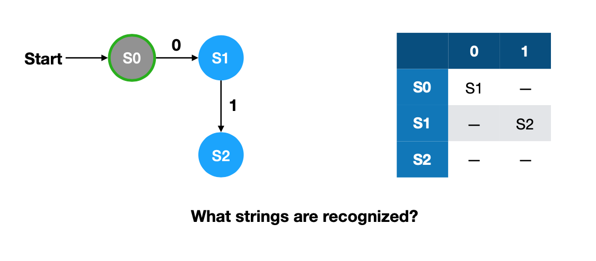
The only string recognized is "01".

#### Example 2

This DFA will recognize any string that begins with "0" with any number of "0"s and "1"s after it.

#### Example 3
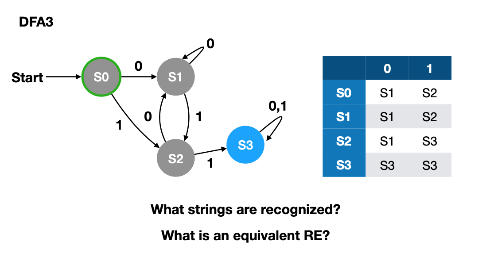
This DFA will recognize any string that has atleast two "1"s. States S0 and S1 can be combined together.

#### Example 4
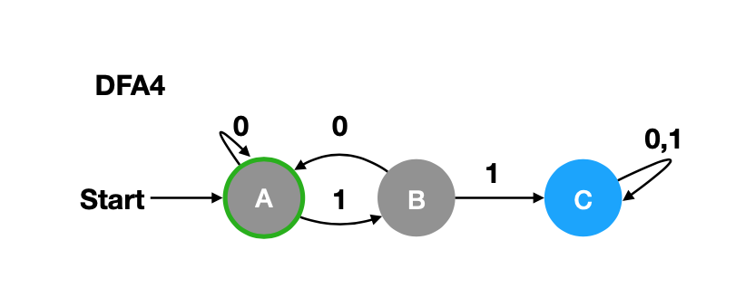
This DFA will recognize strings with atleast two "1"s. Equivalent regex: `0*10*1(0|1)*`

#### Example 5
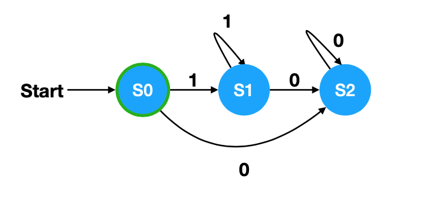
This DFA will recognize non-empty strings except those that ones that have "0"s before "1"s. Also, if the string begins with a "1", it must also have one or more "0"s. Equivalent regex: `0+|1+0+`

#### Example 6
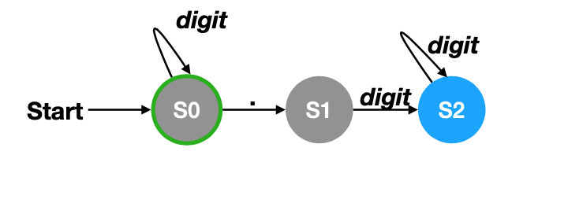
Here is an example of a DFA that recongnizes decimal numbers. There can be zero or more digits before the decimal point, a decimal point, then one or more digits after the decimal point. Equivalent regex: `(digit)*.(digit)+`

### Operations
* Given two DFAs, we can create a one that recognizes the union of the languages
* Simply run both with the same input and accept if either one is in an accept state
* Corresponds to `|` in regular expressions
* We can also create a DFA to recognize the intersection of the languages
* Just run both DFAs and check if *both* accept

## Non-deterministic Finite Automata (NFA)

### Non-determinism
* A DFA only changes state when consuming a symbol
* Each transisition in a DFA is uniquely determined
* NFA's relax both constraints
 * Special "epsilon" transitions don't consume input
 * An NFA may have multiple possible states to transition into for a particular input symbol
* Reading a string may put an NFA into several possible states
* The NFA accepts the string if any of those possible states are accept states
* In a sense, the NFA always makes the "right" choice
* At any given point there is a set of possible states an NFA can be in
* After reading a symbol, the set of possible states will change

### Example

#### String: "baba"
1. We start at state X and recieve a "b" so we can't go anywhere. Possible states: {X}
2. At state X we recieve a "a" so we can either stay at X or transition to Y. Possible states: {X, Y}
3. We could be at states X or Y and recieve a "b". From X we can only stay at X and from Y transition to Z. Possible states: {X, Z}
4. We could be at states X or Z and recieve an "a". From X we can stay, or transition to Y and from Z we can only stay at Z. Final states: {X, Y, Z}
5. Because Z is in our final states, and it is an accept state, the NFA accepts.

#### String: "baa"
1. We start at state X and recieve a "b" so we can't go anywhere. Possible states: {X}
2. At state X we recieve a "a" so we can either stay at X or transition to Y. Possible states: {X, Y}
3. We could be at states X or Y and recieve a "a". From X we can transition to Y or stay at X. From Y we can't go anywhere. Final states: {X, Y}
4. Our final states do not include Z so the NFA rejects.

### Union
To create a union of two NFAs, we simply make a non-deterministic choice between them.
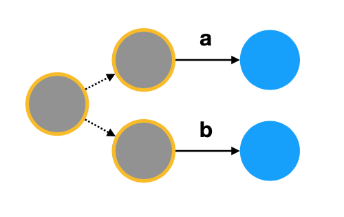

### Concatenation
To concatonate two NFAs, we simply add a null transition from every accept state in the first NFA to the start state of the second NFA.
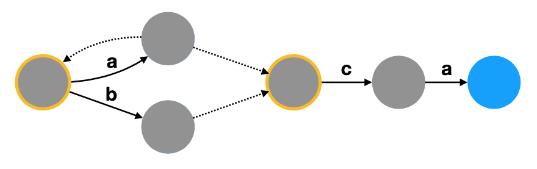

### Repetition
To add repetition to an NFA, we simply add a new start state and add null transitions connecting the new start state and accept state(s).
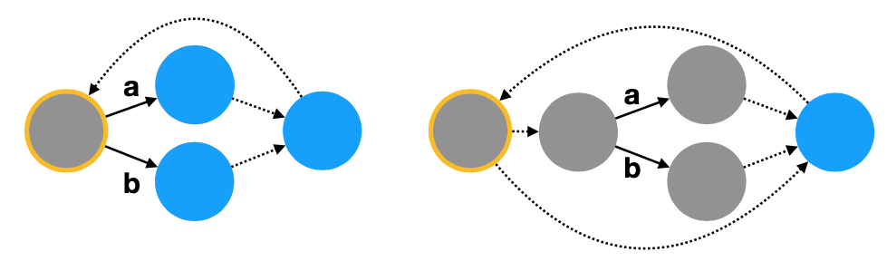

### Simple NFAs
To match a single character we just have a start state transition to an accept state by matching that particular character.

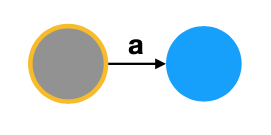

To match the empty string, we simply have an accept state.


### Regex to NFA
* In order to convert regular expressions to NFAs we first create simple NFAs and then link them together based on the regular expression

#### Example: (AB+)*
We first make A

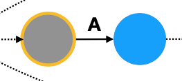

Then we make B

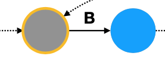

We then make B+ by adding an additional node that loops back to the start of B
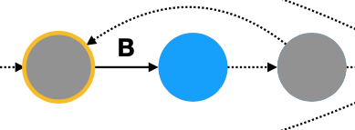

We make AB+ by connecting both parts
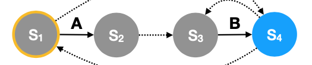

We make (AB+)* by adding an additinal finish node that is connected both ways from the start to the end
*.png)

### Epsilon Closure
The epsilon closure of some state S designated as `ε*(S)` is the set of states reachable from S by taking *zero or more* null transitions. Note that you can always take an epsilon transition to yourself (not taking any transitions).
#### Example:
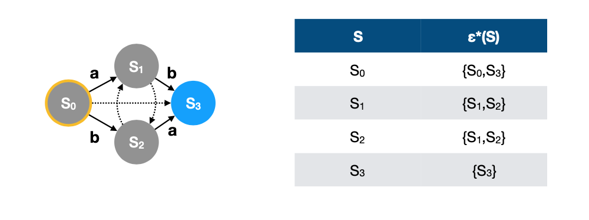
* From S0, we can either stay at S0 or take an epsilon transition to S3. Epsilon closure: {S0, S3}
* From S1, we can stay at S1 or take an epsilon transition to S2 where we can stay at S2 or loop back to S1. Epsilon closure: {S1, S2}
* From S2, we can stay at S2 or take an epsilon transition to S1 where we can stay at S1 or loop back to S2. Epsilon closure: {S1, S2}
* From S3 we can only choose to stay at S3. Epsilon closure: {S3}

### NFAs to DFAs
* When working with a set of possible states we don't need to make any choices
 * ε*(S) — is the set of states reachable from S taking only epsilon transitions
 * δ(S,X) - is the set of states reachable from S by reading input X
* Given at you are in some set of states Γ, the states you can reach by reading an input X include all the states reachable taking epsilon transitions along with readiing that input X
* There are a finite number of states so we could make a DFA where each state corresponds to a set of states in the NFA

#### Example 1
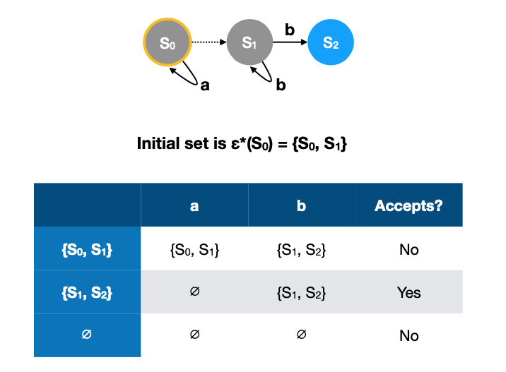

* Here our start states are S0 and S1 because from S0, we can take an epsilon transition to S1
* From {S0, S1} we are given an "A"
 * From S0, we can stay at S0 or we can transition to S1 using the "A"
 * From S1, our only option is to stay at S1
 * Thus we get {S0, S1} as our possible states when read an "A"
* From {S0, S1} we are given an "B"
 * From S0 the only thing we can do is stay put
 * From S1 we can either stay put using an epsilon transition or using the "B", or we can use the "B" to transition to S2"
 * Thus we get {S1, S2} as our possible states when read a "B" (image might be wrong)
* From {S0, S1, S2} we are given an "A"
 * Trivially we can reach S0, S1, and S2 just using epsilon transitions
* From {S0, S1, S2} we are given a "B"
 * Trivially we can reach S0, S1, and S2 just using epsilon transitions

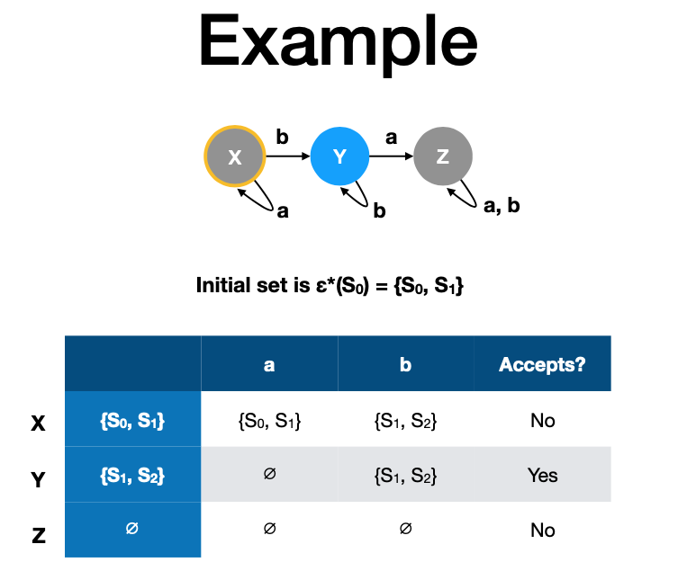

* To create a DFA, we assign each of the unique set of states in the NFA a letter (or any other unique identifier)
* Then we look at the table to determine how they transition

#### Example 2
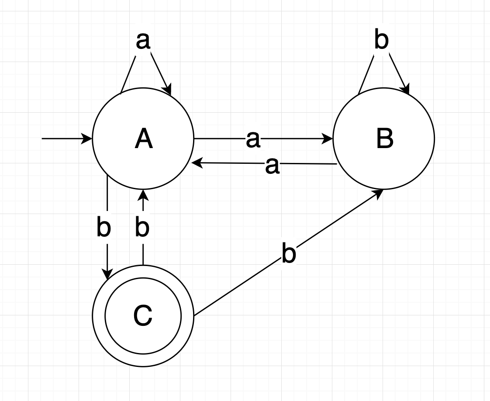
By looking at the transitions, we end up with this following table:

|   | a      | b      |
|---|--------|--------|
| A | {A, B} | {C}    |
| B | {A}    | {B}    |
| C | {}     | {A, B} |

* From A given an "a" we can stay at A or go to B
* From A given a "b" we can go to C
* From B given an "a" we can go to A
* From B given a "b" we can only stay at B
* From C given an "a" we can' go anywhere (failure state)
* From C given a "b" we can go to A or B

We can now expand our chart by looking at where {A, B} takes us.

* From {A, B} given an "a" we can take the union where A and B go when given an "a" which results in {A, B}
* From {A, B} given a "b" we again take the union of A and B which gives us {B, C}

|        | a      | b      |
|--------|--------|--------|
| A      | {A, B} | {C}    |
| B      | {A}    | {B}    |
| C      | {}     | {A, B} |
| {A, B} | {A, B} | {B, C} |

Notice {B, C} is a new set of states so we need to see where it goes.

* From {B, C} given an "a" we get {A}
* From {B, C} given a "b" we get {A, B}

|        | a      | b      |
|--------|--------|--------|
| A      | {A, B} | {C}    |
| B      | {A}    | {B}    |
| C      | {}     | {A, B} |
| {A, B} | {A, B} | {B, C} |
| {B, C} | {A}    | {A. B} |

There were no new set of states introduced so we are done. To make things neater we can rename {A, B} to D and {B, C} to E. Notice that any state that contains C is an accept state.

|   | a   | b   | accept? |
|---|-----|-----|---------|
| A | {D} | {C} | no      |
| B | {A} | {B} | no      |
| C | {}  | {D} | yes     |
| D | {D} | {E} | no      |
| E | {A} | {D} | yes     |

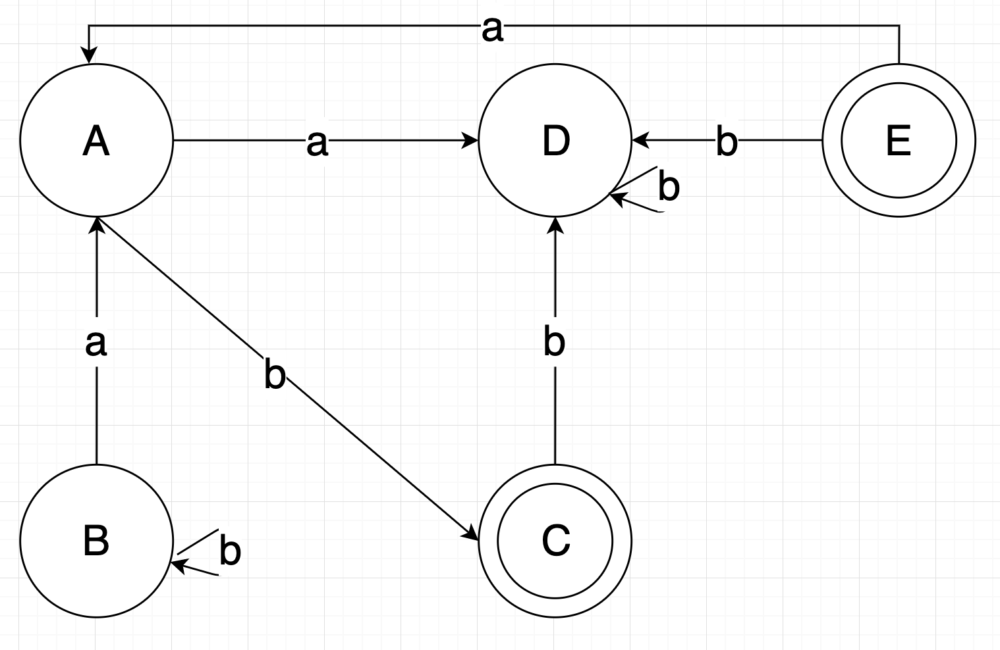

### NFA = DFA = Regex
* For any RE we can construct an equivalent NFA
* For any NFA we can construct an equivalent DFA
* This means NFAs, DFAs, and Regexs have the same power
* It also means we can recognize strings for fixed regular expressions in linear time

## Context Free Grammars

### Grammars
* A grammar describes a languages by giving the structure of its strings
 * Structures can be made of smaller sub-structures until they are individual symbols
* Those structures are called rules
* Rules are made up of both terminal and non-terminal symbols
* Ex: Expr --> Expr + Expr
 * `Expr` is a non-terminal symbol
 * `+` is a terminal symbol
 * Two`expr`s seperated by a `+` is also an `expr`
 * There maybe multiple rules for a given non-terminal symbol
 * A terminal symbol has no further structure

### Example: a^n b^n
* We want to represent a string that has n number of "a"s followed by n number of "b"s
* S --> ε
* S --> aSb
 
### Example: Palindrome
Assuming our languages contains {a, b}:

* S --> ε
* S --> a
* S --> b
* S --> aSa
* S --> bSb

### Parse Trees
* Common way to show a string is part of the language for a CFG
* The children of each node are the symbols for a particular rule
* The root is the starting non-terminal
* Reading nodes left to right gives the original string

**Parsing the palindrome example:**

```
S = "aabbaa"
a - S - a
a - a - S - a - a
a - a - b - S - b - a - a
a - a - b - ε - b - a - a
```

### Ambiguity
* Parse trees are not garunteed to be unique
* If a grammar allows multiple parse trees, it is ambiguous
* Ambiguoity is fine for recognizing but not for interpreting strings


## Logical Programming

### Intro to Logical Programming
* A program is logical specification of desired result
 * Describe facts and rules
 * Solver uses facts and rules to determine new facts
* For a problem, a logic program describes what properties the answer must have

### Relations
* Relations either hold or don't hold
* A single relation can do the work of multiple functions

### Variables
* Variables in Prolog are initially *free* - which means they could have any value
* Goals and rules serve to constrain variables
	* X = 2 - means X must equal 2
	* X * X #= 4 - means that X must be some value who's square is 4 

### Prolog Syntax
* Everything in Prolog is a term
* A term includes:
	* An atom - similar to string literal
  		* A word starting with lower-case letter, number, combination of punctuation characters, or anything in single quotes
  		* Ex: `a`, `atom`, `42`, `hello there`
	* A variable - a word beginning with a capital letter or "_"
		* Ex: `X`, `Y2K`, `_100`, `Path`, `Hello_world`
	* An atom with arguments (can be any term)
		* Ex: `foo(bar)`, `square(2, X)`
		* These are not function calls
		* Some atoms can be infix operators like `1 + 2` same as `+(1, 2)`

### Term Are Tree
* Terms can be represented as trees
* Ex: `person(name('John', 'Smith'), date(1785,6,2), deceased)`

```
             person
      /        |     \ 
   name       date   deceased
 /   |       /   |  \
John Smith 1785  6   2
```

### Facts
* A fact is a term that is present in Prolog's database of facts
* A Prolog source states facts by writing a term followed by a period.
	* food(apple). - States that apple is a food
	* beats(rock, scissors) - States rock beats scissors
	* beats(bomb, Anything) - States bomb beats a variable "Anything" so basically anything

### Rules
* A rule states that a term (consequent) is a fact if other terms (antecedents) are facts
	* eats(johnny, Something) :- food(Something).
	* Means that Johnny is eating if the thing he is eating is food.
	* grandparent(GC, GP) :- parent(GC, P), parent(P, GP).
	* GP is a grandparent of GC if for any P, P is a parent of GC and GP is a parent of P 