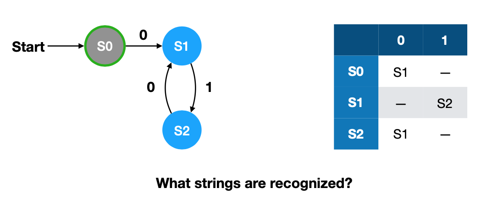
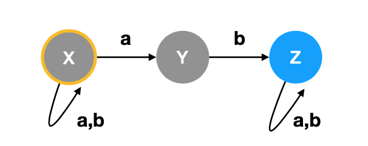

# CS314 Principles of Programming Study Guide

## Programming Languages

### Why Languages?
* Most languages are equally capable in expressing a given algorithm.
* The way they implement them tends to differ depending on the language.
	* Recursion vs loops...
* The ease of use of certain features differ by language
	* Type errors, memory leaks, state issues...


### Programming Paradigms
* Ways at looking at a problem and seeing a program
* Given the task of printing out an ascii art x on the screen using smaller xs, here are two possible ways to do it:
	* Procedurally: print one line of the x at a time from top to bottom
	* Recursively: Recursively print out the four outer corners of the xs until we reach the base case of a single x

```
Goal:
x       x  
  x   x
    x
  x   x
x       x  

Procedural:
x       x
then...
x       x
  x   x
then...
x       x  
  x   x
    x
finally... (skipping a few iterations)
x       x  
  x   x
    x
  x   x
x       x

Recursive:
x       x  
     
    
     
x       x
then...
x       x  
  x   x
    
  x   x
x       x 
finally...
x       x  
  x   x
    x
  x   x
x       x 
```

### Procedural Paradigm
* Programs are sequences of state changing actions
* You can:
	* Name memory spaces (variables)
	* Perform arithmetic
	* Assign values to memory
	* Explicit control flow statements
* Closely matches the Von Neumann architecture
* Can be too low level
	* Always specifies sequential operations
	* Hard to get high-level view of code
	* Unexprected interactions between unrelated code

### Functional Programming
* Programs are based on functions
* Characteristics of pure functional programs:
	* Variable names name values and not memory locations
	* Value binding over parameter passing (call by reference, call by value...)
	* Recursion over iteration
* Key operations are based on function application and function abstraction (lambda calculus)
* Functional languages tend to have:
	* Composition of functions
	* First class funcitons
	* Pure and total functions
* Functional programming is more declarative as in you describe what the answer should be and not how to compute it
* Requires a sophisticated compiler for good performance

### Logic Paradigm
* The most declarative paradigm
* Question and answer format
* Compiler has great freedom in the methods involved with finding the answer

### Translation
* Compilation works by translating the high level language into an executable form - usually machine code
* Interpretation works by having the program performed by a different executable program
* Some languages like Java are a mixture

## Functional Programming

### Expressions
* An expression represents a computation on values, and or sub-expressions
* We *evaluate* an expression to produce a value
* 	3 + (4 * 5) = 21

### Abstract Syntax Trees
* It is possible to describe an expression using a tree
	* Interior nodes correspond to operations
	* Leaf nodes corrrespond to literal values
* To evaluate, start at the leaves and then work up

### Variables
* Variables are abstract values
* Meaning of a variable depends on context
* Looking at the expression `x + 2` we can say that `x` is unconstrained and there for, *free*
* Evaluation will produce different values depending on what `x` is equal to

### Evaluating Variables
* A substitution maps variables names to expressions
* We can replace a variable with it's corresponding value which gives an instance of the expression
* Given we have `x + 2` if we say `x` equals `3` then the instance of the expression is `3 + 2 = 5`

### Bound Variables
* Say we are given a summation of `n^2` from `n = 1` to `100`
* Here we can see that `n^2` is parameterized by `n^2`
* The meaning of `n` is determined by the summation construct (it changes every iteration)
* We can say that `n` is a bound variable
* To evaluate this expression we must substitute in all the different values for n and add them together
	* `1^2 + 2^2 + 3^2 + ... + 100^2`

### Functions
* Functions map values in one set (domain) to values in another set called (co-domain)
	* Each element in the domain maps to a single element in the co-domain
	* Multiple elements may map to the same element in the co-domain but not the other way around 

### Function Abstraction
* We can define a function to calculate x * 2 + 3 for argument x in lambda calculus by the following format: (λx. x * 2 + 3)
	* λx indicates that x is the parameter
	* x * 2 + 3 is the function body
	* The parentheses indicate the *binding scope* of x

### α-Equivalence
* The name of bound variables are not considered significant so (λx. x * 2 + 3) and (λy. y * 2 + 3) are considered the same
* α-conversion lets us change the name of a bound variable
* If two expressions can be α-converted to produce the same expression, they are said to be α-equivalent

### Function Application
* Functional languages make application as minimal as possible
* In haskell we can apply function f to argument x by writing `f x`
* Function application has the highest precidense so `f 2 + 3` is equal to `(f 2) + 3`
* Function application always associates to the left so `g f x` is equal to `(g f) x`

### Evaluation by Substitution
* We can evaluate a function applied to an argument by substituting in for the variable
* This is called β-reduction
* Two expressions are considered the same if the produce the same expression after being β-reduced

### Evaluation Order
* If we evaluate the argument first then we get applicative-order evaluation (calculating the argument first)
* If we evaluate the application first then we get normal-order evaluation (substituting the argument first)
* They both produce the same result

### Multiple Parameters
* We can apply multiple parameters to a function by returning a function after applying the first argument, to apply the second one
* Lets say we want to define a function where given x and y, return (x + y) / 2
* We get `(λx. (λy. (x + y) / 2))`, where the first function `λx. (λy. (x + y) / 2)` returns the function `λy. (x + y) / 2` after substituting for x, in which case we can then substitute for y. Lets try applying it to 3 and 5
	* (λx. (λy. (x + y) / 2)) 3 5
	* (λy. (3 + y) / 2) 5
	* (3 + 5) / 2
	* 4

### Higher-order Functions
* It is possible for functions to be an argument for other functions
* Given (λf. f 0) we take function f and apply it to 0

### Normal Forms
* We use β-reduction to transform expressions into simpler ones
* If no β-reduction is possible, then we are in β-normal form
* If the head of the expression is not an application then the expression is in head-normal form

## Haskell

### Basic Syntax
* Expressions: `1 + 1`, `3 * (5 - 2) / 3`
* Annonymous functions (lambda abstractions): `\x -> 3 * 5 + 1`
* Variables in haskell must begin with a lower case letter or `_`

### Definitions
* Defining a variable: `a = 5`
* Defining a function: `fun x y z = x + y + z`

### if-then-else and Bool
* Haskell has a Bool type of values True and false
* Comparison functions like `== or > or >=` all return a Bool
* We can use `if <some boolean expression> then <statement a> else <statement b>` to choose between values
	* We must always include both branches

### Writing Functions
* Given the following function to calculate factorials: `fac n = if n > 1 then n * fac (n - 1) else 1` we can see that if n is greater than one we recurse and otherwise we just return 1 as the base case

### Lists
* []

## Formal Languages

### Terminology
* An alphabet is a set of symbols (characters or bits)
* A string (of alphabet Σ) is a sequence of symbols belonging to Σ
* A language (of alphabet Σ) is a (possibly infinite) set of strings over Σ

### Example
* Given an alphabet of `{a, b}`
* We can specify rules such as a is never followed by a and b is never followed by b
* Strings would include: `"", "a", "b", "ab", "ba", "aba" ...`
* But not include: `"ac", "dse", "aa", "bb" ...`
* Can be described by (a|ε)(ba)*(b|ε)


### Regular Expressions
* A formalism for specifying languages
* Regular expressions are atomic
 * Atomic: single symbol, empty string ε
 * Composite: contatenation (+), choice (|), repetition (*)
* Regular expressions map directly into operators that manipulate sets of strings 

### Semiring Algebra
* Algebraic structure with two binary operators and two distinguished values that satisfy certain laws
 *  Numbers, Booleans, Polynomials
* For regex, Never --> 0, Empty --> 1, :+ --> +, and  :* --> *


### Infinite Sets
* Due to haskell's laziness, there might be some problems when a language is infinite
* Instead of using concat (++) we use interleave instead or fairUnion

### Matching a Regex
* Given a regex and a string do they match?
* Most thing are fairly simple except concatenation and repeats

### Concatenation
* Naive approach is to given string S, we spit it into two sections R and T. Then we attempt every possible split and see if anyone of them match.
* Mostly works, but performace is poor for larger strings and does not work for the `R**` case

### What is wrong with R**
* R* =  ε | RR*
* To match RS against w, we find all u, v such that w = uv
* What if R can match the empty string?
* We try u = ε and v = w and see if we can match R with ε and R* with w
* This gets us stuck in an infinite loop

### Fixing R**
* We know that any string that matches R* will contain zero or more non-empt strings that match R
* Any empty strings that match R can be ignored
* Therefore we modify our match so that we only try to match r with non empty strings for the case of R**

### Performance of (a* a)
* To match `a*a` against "aaaa" we have to repeatedly match `a*` with larger substrings
* In this case we must match "aa", "aaa", and "aaaa" until we get to a match
* There are a total of 2 + 3 + 4 = 9 matches
* In general there are 2 + 3 + 4 + ... + n-1 = O(n^2) comparisons

### Another Method
* Say we want to match R with string w
* If w is empty we can check if R matches ""
* If w is a:w1, we could try to find D(R) such that D(R) matches w1 and only if R matches w
* D(R) is known as taking the derivative of R
* We match the whole string by repeatedly taking derivatives until we get to the end of the string
* Then we check if the final derivative accepts empty string

### Finding Derivatives
* How do we compute D(R)?
* Da(a) = ε because a matches a single "a" followed by nothing
* Da(b) = ∅ because nothing that comes after a b could result in us matching a
* Da(ε)= ∅ and Da(∅) = ∅ because there is no way we could match a
* Da(R | S) = Da(R) | Da(S)
* Note: ∅ | R = R = R | ∅
* How about RS?
* If R does not match "", then Da(RS) = Da(R)S
 * Means we will match the rest of R and then S
* If R can match "", we could also match the first part of S
 * Da(RS) = Da(R)S | Da(S)

### Derivative Table

|   R   |          Dx(R)         |                                                           |
|:-----:|:----------------------:|:---------------------------------------------------------:|
|   ∅   |            ∅           |             Nothing can never  match anything             |
|   ε   |            ∅           |      There is nothing to match after an empty string      |
|   x   |            ε           | We match an x and then there is only an empty string left |
|   y   |            ∅           |                           x != y                          |
| R | S |      Dx(R) | Dx(S)     |                                                           |
|   RS  | Atε(R) Dx(S) | Dx(R) S |        Atε(R) is ε if R  matches “” and  ∅ otherwise      |
|   R*  |        Dx(R) R*        |                                                           |


### Using Derivatives
* Does "xy" match `(xy)*`?
* `Dx((xy)*)` = `Dx(xy)(xy)*` = `Dx(x) y(xy)*` = `εy(xy)*` = `y(xy)*` Here we are able to match a single "x" which means we have a left over "y" and then a variable number of "xy"s left
* `Dy(y*xy)*)` = `Dy(y)(xy)*` = `ε(xy)*` = `(xy)*` Here we match the single "y"

### Efficiency
* Derivatives never need to back track so the number of derivatives required is never more than the length of the string
* Certain expressions can lead to exponential blow-up in the serivative size
* Mainly in cases of repeats
 * `Dx(x**)` = `Dx(x*) x**` = `Dx(x) x* x**` = `x*x**`
 * `Dx(x*x**)` = `Dx(x**) | Dx(x*) x**` = `x*x** | x*x**`
* Not exactly linear time

## Automata

### Formal Automata
* Automatons have:
 * input
 * a finite set of states
 * a set of transition rules
 * possibly other memory
* Classes of automata
 * Based on what memory they have
  * Finite-State Automaton (FSA or FA) have no additional memory
 * Different classes recognize different kinds of languages
  * FAs recognize same languages as REs

### DFA
* Described by:
 * <set of states, labled transitions, start state, final states>
* <{S0, S1, S2}, {<S0, 0> --> S1, <S0, 1> --> S2}, S0, {S1, S2}>
 * We have states: S0, S1, and S2
 * If we encounter a 0 at S0 we transition to S1
 * If we encounter a 1 at S0 we transition to S2
 * Our start state is S0
 * Our accept states are S1 and S2
* A DFA accepts (recognizes) an inpust string if and only if there is a path from the start state to the final state

### Failure State
* If there is no transition given for a <state, input> pair then it implicitly leads to a permanent fialure state

### DFA Examples

#### Example 1

The only string recognized is "01".

#### Example 2

This DFA will recognize any string that begins with "0" with any number of "0"s and "1"s after it.

#### Example 3

This DFA will recognize any string that has atleast two "1"s. States S0 and S1 can be combined together.

#### Example 4

This DFA will recognize strings with atleast two "1"s. Equivalent regex: `0*10*1(0|1)*`

#### Example 5

This DFA will recognize non-empty strings except those that ones that have "0"s before "1"s. Also, if the string begins with a "1", it must also have one or more "0"s. Equivalent regex: `0+|1+0+`

#### Example 6

Here is an example of a DFA that recongnizes decimal numbers. There can be zero or more digits before the decimal point, a decimal point, then one or more digits after the decimal point. Equivalent regex: `(digit)*.(digit)+`

### Operations
* Given two DFAs, we can create a one that recognizes the union of the languages
* Simply run both with the same input and accept if either one is in an accept state
* Corresponds to `|` in regular expressions
* We can also create a DFA to recognize the intersection of the languages
* Just run both DFAs and check if *both* accept

## Non-deterministic Finite Automata (NFA)

### Non-determinism
* A DFA only changes state when consuming a symbol
* Each transisition in a DFA is uniquely determined
* NFA's relax both constraints
 * Special "epsilon" transitions don't consume input
 * An NFA may have multiple possible states to transition into for a particular input symbol
* Reading a string may put an NFA into several possible states
* The NFA accepts the string if any of those possible states are accept states
* In a sense, the NFA always makes the "right" choice
* At any given point there is a set of possible states an NFA can be in
* After reading a symbol, the set of possible states will change

### Example

#### String: "baba"
1. We start at state X and recieve a "b" so we can't go anywhere. Possible states: {X}
2. At state X we recieve a "a" so we can either stay at X or transition to Y. Possible states: {X, Y}
3. We could be at states X or Y and recieve a "b". From X we can only stay at X and from Y transition to Z. Possible states: {X, Z}
4. We could be at states X or Z and recieve an "a". From X we can stay, or transition to Y and from Z we can only stay at Z. Final states: {X, Y, Z}
5. Because Z is in our final states, and it is an accept state, the NFA accepts.

#### String: "baa"
1. We start at state X and recieve a "b" so we can't go anywhere. Possible states: {X}
2. At state X we recieve a "a" so we can either stay at X or transition to Y. Possible states: {X, Y}
3. We could be at states X or Y and recieve a "a". From X we can transition to Y or stay at X. From Y we can't go anywhere. Final states: {X, Y}
4. Our final states do not include Z so the NFA rejects.

### Union
To create a union of two NFAs, we simply make a non-deterministic choice between them.


### Concatenation
To concatonate two NFAs, we simply add a null transition from every accept state in the first NFA to the start state of the second NFA.


### Repetition
To add repetition to an NFA, we simply add a new start state and add null transitions connecting the new start state and accept state(s).


### Simple NFAs
To match a single character we just have a start state transition to an accept state by matching that particular character.


To match the empty string, we simply have an accept state.


### Regex to NFA
* In order to convert regular expressions to NFAs we first create simple NFAs and then link them together based on the regular expression

#### Example: (AB+)*
We first make A


Then we make B


We then make B+ by adding an additional node that loops back to the start of B


We make AB+ by connecting both parts


We make (AB+)* by adding an additinal finish node that is connected both ways from the start to the end
*.png)

### Epsilon Closure
The epsilon closure of some state S designated as `ε*(S)` is the set of states reachable from S by taking *zero or more* null transitions. Note that you can always take an epsilon transition to yourself (not taking any transitions).
#### Example:

* From S0, we can either stay at S0 or take an epsilon transition to S3. Epsilon closure: {S0, S3}
* From S1, we can stay at S1 or take an epsilon transition to S2 where we can stay at S2 or loop back to S1. Epsilon closure: {S1, S2}
* From S2, we can stay at S2 or take an epsilon transition to S1 where we can stay at S1 or loop back to S2. Epsilon closure: {S1, S2}
* From S3 we can only choose to stay at S3. Epsilon closure: {S3}

### NFAs to DFAs
* When working with a set of possible states we don't need to make any choices
 * ε*(S) — is the set of states reachable from S taking only epsilon transitions
 * δ(S,X) - is the set of states reachable from S by reading input X
* Given at you are in some set of states Γ, the states you can reach by reading an input X include all the states reachable taking epsilon transitions along with readiing that input X
* There are a finite number of states so we could make a DFA where each state corresponds to a set of states in the NFA

#### Example 1


* Here our start states are S0 and S1 because from S0, we can take an epsilon transition to S1
* From {S0, S1} we are given an "A"
 * From S0, we can stay at S0 or we can transition to S1 using the "A"
 * From S1, our only option is to stay at S1
 * Thus we get {S0, S1} as our possible states when read an "A"
* From {S0, S1} we are given an "B"
 * From S0 the only thing we can do is stay put
 * From S1 we can either stay put using an epsilon transition or using the "B", or we can use the "B" to transition to S2"
 * Thus we get {S1, S2} as our possible states when read a "B" (image might be wrong)
* From {S0, S1, S2} we are given an "A"
 * Trivially we can reach S0, S1, and S2 just using epsilon transitions
* From {S0, S1, S2} we are given a "B"
 * Trivially we can reach S0, S1, and S2 just using epsilon transitions


* To create a DFA, we assign each of the unique set of states in the NFA a letter (or any other unique identifier)
* Then we look at the table to determine how they transition

#### Example 2

By looking at the transitions, we end up with this following table:

|   | a      | b      |
|---|--------|--------|
| A | {A, B} | {C}    |
| B | {A}    | {B}    |
| C | {}     | {A, B} |

* From A given an "a" we can stay at A or go to B
* From A given a "b" we can go to C
* From B given an "a" we can go to A
* From B given a "b" we can only stay at B
* From C given an "a" we can' go anywhere (failure state)
* From C given a "b" we can go to A or B

We can now expand our chart by looking at where {A, B} takes us.

* From {A, B} given an "a" we can take the union where A and B go when given an "a" which results in {A, B}
* From {A, B} given a "b" we again take the union of A and B which gives us {B, C}

|        | a      | b      |
|--------|--------|--------|
| A      | {A, B} | {C}    |
| B      | {A}    | {B}    |
| C      | {}     | {A, B} |
| {A, B} | {A, B} | {B, C} |

Notice {B, C} is a new set of states so we need to see where it goes.

* From {B, C} given an "a" we get {A}
* From {B, C} given a "b" we get {A, B}

|        | a      | b      |
|--------|--------|--------|
| A      | {A, B} | {C}    |
| B      | {A}    | {B}    |
| C      | {}     | {A, B} |
| {A, B} | {A, B} | {B, C} |
| {B, C} | {A}    | {A. B} |

There were no new set of states introduced so we are done. To make things neater we can rename {A, B} to D and {B, C} to E. Notice that any state that contains C is an accept state.

|   | a   | b   | accept? |
|---|-----|-----|---------|
| A | {D} | {C} | no      |
| B | {A} | {B} | no      |
| C | {}  | {D} | yes     |
| D | {D} | {E} | no      |
| E | {A} | {D} | yes     |


### NFA = DFA = Regex
* For any RE we can construct an equivalent NFA
* For any NFA we can construct an equivalent DFA
* This means NFAs, DFAs, and Regexs have the same power
* It also means we can recognize strings for fixed regular expressions in linear time

## Context Free Grammars

### Grammars
* A grammar describes a languages by giving the structure of its strings
 * Structures can be made of smaller sub-structures until they are individual symbols
* Those structures are called rules
* Rules are made up of both terminal and non-terminal symbols
* Ex: Expr --> Expr + Expr
 * `Expr` is a non-terminal symbol
 * `+` is a terminal symbol
 * Two`expr`s seperated by a `+` is also an `expr`
 * There maybe multiple rules for a given non-terminal symbol
 * A terminal symbol has no further structure

### Example: a^n b^n
* We want to represent a string that has n number of "a"s followed by n number of "b"s
* S --> ε
* S --> aSb
 
### Example: Palindrome
Assuming our languages contains {a, b}:

* S --> ε
* S --> a
* S --> b
* S --> aSa
* S --> bSb

### Parse Trees
* Common way to show a string is part of the language for a CFG
* The children of each node are the symbols for a particular rule
* The root is the starting non-terminal
* Reading nodes left to right gives the original string

**Parsing the palindrome example:**

```
S = "aabbaa"
a - S - a
a - a - S - a - a
a - a - b - S - b - a - a
a - a - b - ε - b - a - a
```

### Ambiguity
* Parse trees are not garunteed to be unique
* If a grammar allows multiple parse trees, it is ambiguous
* Ambiguoity is fine for recognizing but not for interpreting strings


## Logical Programming

### Intro to Logical Programming
* A program is logical specification of desired result
 * Describe facts and rules
 * Solver uses facts and rules to determine new facts
* For a problem, a logic program describes what properties the answer must have

### Relations
* Relations either hold or don't hold
* A single relation can do the work of multiple functions

### Variables
* Variables in Prolog are initially *free* - which means they could have any value
* Goals and rules serve to constrain variables
	* X = 2 - means X must equal 2
	* X * X #= 4 - means that X must be some value who's square is 4 

### Prolog Syntax
* Everything in Prolog is a term
* A term includes:
	* An atom - similar to string literal
  		* A word starting with lower-case letter, number, combination of punctuation characters, or anything in single quotes
  		* Ex: `a`, `atom`, `42`, `hello there`
	* A variable - a word beginning with a capital letter or "_"
		* Ex: `X`, `Y2K`, `_100`, `Path`, `Hello_world`
	* An atom with arguments (can be any term)
		* Ex: `foo(bar)`, `square(2, X)`
		* These are not function calls
		* Some atoms can be infix operators like `1 + 2` same as `+(1, 2)`

### Term Are Tree
* Terms can be represented as trees
* Ex: `person(name('John', 'Smith'), date(1785,6,2), deceased)`

```
             person
      /        |     \ 
   name       date   deceased
 /   |       /   |  \
John Smith 1785  6   2
```

### Facts
* A fact is a term that is present in Prolog's database of facts
* A Prolog source states facts by writing a term followed by a period.
	* food(apple). - States that apple is a food
	* beats(rock, scissors) - States rock beats scissors
	* beats(bomb, Anything) - States bomb beats a variable "Anything" so basically anything

### Rules
* A rule states that a term (consequent) is a fact if other terms (antecedents) are facts
	* eats(johnny, Something) :- food(Something).
	* Means that Johnny is eating if the thing he is eating is food.
	* grandparent(GC, GP) :- parent(GC, P), parent(P, GP).
	* GP is a grandparent of GC if for any P, P is a parent of GC and GP is a parent of P 